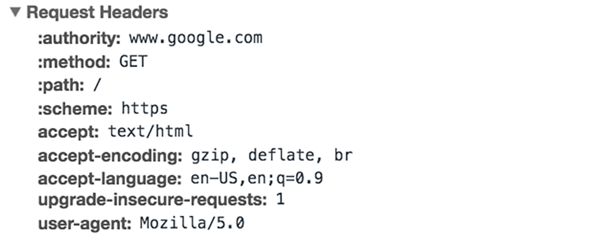
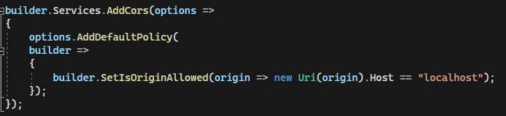

# How can CORS protect the microservice APIs in the bingocard generator?

## Table of Contents

- [How can CORS protect the microservice APIs in the bingocard generator?](#how-can-cors-protect-the-microservice-apis-in-the-bingocard-generator)
  - [Table of Contents](#table-of-contents)
  - [Subquestions](#subquestions)
    - [What is an HTTP request (library research?)](#what-is-an-http-request-library-research)
    - [What is CORS? (Library research)](#what-is-cors-library-research)
    - [What is the downside to using CORS?](#what-is-the-downside-to-using-cors)
    - [Should CORS be used in the bingo card API project?](#should-cors-be-used-in-the-bingo-card-api-project)
    - [How to implement CORS in the Bingo card APIs? (Prototype)](#how-to-implement-cors-in-the-bingo-card-apis-prototype)
  - [Conclusion](#conclusion)
  - [Scources](#scources)

## Subquestions

### What is an HTTP request (library research?)

An HTTP(HyperText Transfer Protocol) request is a way for browsers to request the data it needs to load a website.
Each HTTP request contains a set of encoded data in it.
Typically an HTTP request contains:

1. The HTTP version type

2. a Url. This is the adress of the request.

3. a HTTP method.
   This defines what type of request it is. A few common request types are: GET, POST, UPDATE and DELETE
   With CORS you can even restrict the types of HTTP requests an origin has access to.

4. HTTP Request headers.
   Request headers contain text information stored in key-value pairs and they are inclued in every HTTP request and respones. They comunitate vital information such as what browser is being used and what data is being requested.
   

_This is an example from google chrome's network tab_

5. HTTP body (This one is optional)
   If included this can contain things like variables that are not yet included in the url.

After an HTTP request has been send, what usually follows is an HTTP response. These usually contian:

1. An HTTP Status code:
   These are 3 digit codes wich detail wheter the request was succesfull and if not what went wrong. The codes are devided in 5 blocks

- 1xx Infromational
- 2xx Success
- 3xx Redirection
- 4XX Client eror
- 5xx Server error

2. HTTP response headers

3. HTTP response body (optinal)
   If the client requested data it will be stored here.

### What is CORS? (Library research)

CORS (Cross Origin Rescourse Sharing) is an HTTP based protocol to control wich origins other then itself have acces to certain recourses. This works by adding an extra step to the HTPP process. This step is making the origin send a so called 'preflight' request to the rescourse. This is a request that contains all the nececery information for the server to check if an origin is allowed to make requests. If an origin is not allowed to make request it sends back an error code ending the process early. But if an origin is allowed to send requests to the server, the server sends back a signal to the origin telling it to send the actual request over. This request then gets handled like normal.

By default browsers restrict cross origin HTTP requests. This means that a resource (for example an API) only allows requests from the same origin that hosts the API.
By using CORS you can allow specific other origins to acces the rescource while maintaining the restriction on all other origins.

### What is the downside to using CORS?

CORS allows diffrent origins to comunitate to each other. This is both it's purpose and it's biggest risk.
Because if CORS is not set up correctly it can lead to cross-origin attack wich can lead to senesitive data being leaked online.

Thing to keep in mind when setting up CORS are:

- Do not use an asterisk (\*) when making the Acces-Control-Allow-Origin. This will allow any origin to make requests to the server.
- Do not use a null value when making the Acces-Control-Allow-Origin. this will have the same effect as using an \*
- Do not set up a dynamic Acces-Control-Allow-Origin without proper sever side validation. If this is done incorrectly it could open a backdoor for unwanted requests.

### Should CORS be used in the bingo card API project?

CORS should be used in situations where requests have to be sent from a diffrent origin then the API server, while maintaining restrictions from other external origins. Because the bingo card project has difrent modules on diffrent origins that need to comunicate with each other this means that CORS is needed. It should be implemented in both APIs, altough ideally all comunication between the client and the backend should go trough one central gateway service wich redirect the requests to the appropriate API. This would make the application as a whole more secure.

### How to implement CORS in the Bingo card APIs? (Prototype)

CORS can be added in the startup files of the APIs. In here you can specify what origins are allowed to acces the API. During development this can simply be all localhost posts.

But once the app is being deployed this should be changed to the actual host of the frontend. Once this is done only the frontend can acces the API and no other place.

## Conclusion

CORS can protect the bigno card APIs by allowing only specific other origins (I.E. the frontend) to make requests to it. This means that a request from any other place (like another website) will be blocked.

## Scources

- [used on 21-11-2022](https://developer.mozilla.org/en-US/docs/Web/HTTP/CORS)
- [used on 08-01-2023](https://www.cloudflare.com/learning/ddos/glossary/hypertext-transfer-protocol-http/)
- [used on 08-01-2023](https://www.healthit.gov/faq/what-does-https-web-address-mean)
- [used on 08-01-2023](https://www.tenable.com/blog/understanding-cross-origin-resource-sharing-vulnerabilities)
