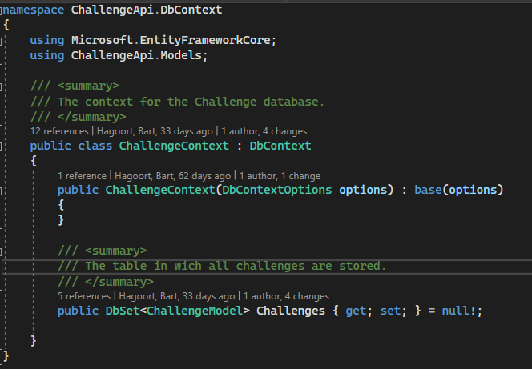
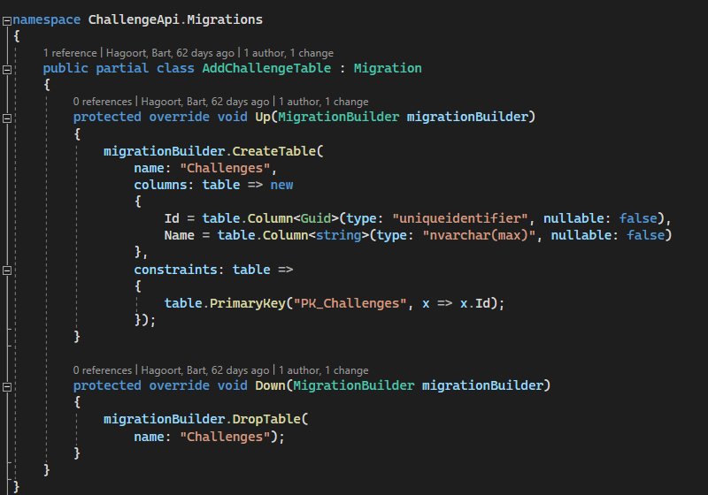

# How can Entity Framework speed up the development of the Bingo Card Generator project?

## Table of Contents

- [How can Entity Framework speed up the development of the Bingo Card Generator project?](#how-can-entity-framework-speed-up-the-development-of-the-bingo-card-generator-project)
  - [Table of Contents](#table-of-contents)
  - [Subquestions](#subquestions)
    - [**What is the entity framework? (Library research)**](#what-is-the-entity-framework-library-research)
    - [**What is ORM? (Library research)**](#what-is-orm-library-research)
    - [**How does entity framework work? (library research)**](#how-does-entity-framework-work-library-research)
      - [**What is a model?**](#what-is-a-model)
      - [**What is a migration?**](#what-is-a-migration)
    - [**How to implement EF in the bingo card APIs? (Prototype)**](#how-to-implement-ef-in-the-bingo-card-apis-prototype)
  - [Conclusion](#conclusion)
  - [Sources](#sources)

## Subquestions

### **What is the entity framework? (Library research)**

Entity framework is a lightweight data acess framework. It makes it easy to make, intergrate and maitain a SQL database for your project.
It can serve as an ORM wich enabels you to use your database with .NET objects. And makes it so you do not have to write Data acces code.

### **What is ORM? (Library research)**

Object Relational Mapping (ORM) is a technique used by Object oriënted programmers to create bridge between an object oriënted program (OOP) and a (relational) database.

While using an OOP language like C# called CRUD (Create,Read,Update Delete) actions have to be created to manage the enties in the various database tables. The database language (My)SQL lends itself really well for these operations. But writing the querries for these operations can be tedious.
ORM tools like entity framework can help simplify the interaction between a relational database and OOP languages.

for example:

```
"SELECT id, name, email, country, phone_number FROM users WHERE id = 20"
```

can become this by using an ORM tool:

```
users.GetById(20)
```

Both lines give the same result but the ORM does it with a much more user friendly method.

### **How does entity framework work? (library research)**

With EF core, data acces is done trough a 'model'.

A model consists of entity classes and a context object wich represents the database session. The context object does the queriying and the saving of the data. While the entity classes serve as the objects that OOP code can use.

To use entity framwork you have to first make a model. You can either generate one from an exsiting database or you can make one yourself by hand. Once a model has been created EF Migrations has to make a database from the model.

By combining migrations and the model Entity framework creates the bridge between code and database. It'll also simplify querrying the database for the user by provinding easy to understand methods that run the complex querries behind the scenes.

#### **What is a model?**

As stated earlier a model consists of two components.

The first is the Context object. this object is in charge of running the querries and saving the data to the database. It contains all the rules the database has to use, such as what tables it expects with what keys.

The second component is the Entity classes.
These are very similar to C# classes in that they contain the definition of objects used by the code. Unlike C# classes they usually do not contain any acutal methods or code.
Entity classes are mappped to database tables and must be included in a DBset within the context object.

#### **What is a migration?**

A migration is a way for entity framework to keep the database schema in sync with the EF core model by preserving the data. When creating a migration Entity framework will look at it's model and it will create insctructions for making of updating the database. It will tell the database what tables to create (in the case of the bingocard generator these will be the card challenge and the cardhaschallenge tabels.) along with what keys are on the tables. Afterward the database can be updated using these instructions.

In short a migration will assure that the database is compatible with the code.

### **How to implement EF in the bingo card APIs? (Prototype)**

To intergrate EF into the APIs the NUGet packages first have to be installed. Once this is done a model (context) can be created.


Then the comand Add-Migration MyMigration can be ran (where MyMigration is the name of the migration). This command will then generate the migration that EF uses to create the database


Optinally a database seed can be created that will run when the application starts and will fill the database with some predetermined data. But this is not part of EF and not required.

## Conclusion

Writing SQL can be a long complex and confusing process. Using Enity framework can make this process much more understandable because it works directly with OOP. It also eleminates the need for writing SQL querries completely. It even takes care of updating the database schema.
Therefore it frees up the time that would be used for these tasks for actual development of the project.

## Sources

- [Enity Framework Documentation used on 12-12-22](https://learn.microsoft.com/en-us/ef/core/)
- [ORM used on 12-12-22](https://www.freecodecamp.org/news/what-is-an-orm-the-meaning-of-object-relational-mapping-database-tools/)
- [Migrations used on 12-12-22](https://www.learnentityframeworkcore.com/migrations)
- [Entities used on 12-12-22](https://www.entityframeworktutorial.net/basics/entity-in-entityframework.aspx#:~:text=An%20entity%20in%20Entity%20Framework%20is%20a%20class%20that%20maps,a%20column%20in%20the%20database.)
- [Entity framework used on 12-12-22](https://www.entityframeworktutorial.net/basics/how-entity-framework-works.aspx)
